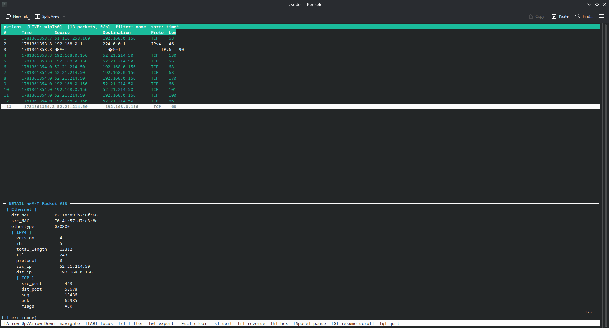

# PKTLENS

**pktlens** is a Unix-native, terminal-based packet capture viewer designed for developers, system administrators, and network engineers who need a fast, readable interface for inspecting `.pcap` files and live network traffic — without the installation overhead of Wireshark or the visual hostility of raw tcpdump output.



## Features

- **Instant load** — opens multi-megabyte captures in under a second
- **Live capture** — attach to any network interface with `-i eth0`; packets stream in real time with auto-scroll and a packets-per-second counter
- **Protocol-coloured packet list** — TCP, UDP, DNS, HTTP, ICMP, ARP each get a distinct colour
- **Filter language** — `tcp and dst 8.8.8.8`, `not udp`, `port 443`, `len > 512`, full boolean logic with parentheses; filter works identically in file and live mode
- **Export** — write the current filtered+sorted view to a new `.pcap` file with `w`
- **Sortable view** — by timestamp, packet size, or protocol; ascending or descending
- **Protocol tree** — decoded field-by-field view of the selected packet with scrolling
- **Hex dump** — raw bytes with ASCII sidebar, toggled with `h`
- **Terminal resize** — live SIGWINCH handling, layout reflows automatically
- **No runtime dependencies** — static binary available, drops onto any Linux system

> **Protocol support:** Full dissection for Ethernet, VLAN (802.1Q), MPLS, IPv4, IPv6 (including extension headers), TCP, UDP, ICMP, ICMPv6, ARP, DNS (queries, responses, A/AAAA records), DHCP (options, message types), HTTP (request/response lines, headers), TLS/HTTPS (record layer, handshake, SNI extraction), SSH (version string, key exchange), FTP, SMTP, NTP.

---

## Installation

### Pre-built binary (recommended)

Download the latest release from the `./releases` folder:

| Platform            | Binary           |
|---------------------|------------------|
| Linux x86\_64 static | `pktlens_static` |

```bash
chmod +x pktlens_static
./pktlens_static capture.pcap          # file mode
sudo ./pktlens_static -i eth0          # live mode (requires root or setcap)
```

The static binary has no runtime dependencies and runs on any Linux kernel 3.x or later.

### Build from source

**Requirements:**

- GCC 4.8+ or Clang 3.5+ (C++14)
- CMake 3.10+
- libpcap + headers (`libpcap-devel` on Fedora, `libpcap-dev` on Debian/Ubuntu)
- ncurses + headers (`ncurses-devel` / `libncurses-dev`)

```bash
git clone https://github.com/yourname/pktlens.git
cd pktlens
mkdir build && cd build
cmake ..
make -j$(nproc)
sudo make install          # installs to /usr/local/bin
```

**Fedora / RHEL:**
```bash
sudo dnf install libpcap-devel ncurses-devel cmake gcc-c++
```

**Debian / Ubuntu:**
```bash
sudo apt install libpcap-dev libncurses-dev cmake g++
```

### Live capture permissions

Live capture requires `CAP_NET_RAW`. Either run as root or grant the capability to the binary once:

```bash
sudo setcap cap_net_raw+eip /usr/local/bin/pktlens
```

After this, `pktlens -i eth0` works without sudo.

---

## Usage

```bash
pktlens <file.pcap>           # open a capture file
pktlens -i <interface>        # live capture on an interface
pktlens --list-interfaces     # print available interfaces
pktlens --help                # full key reference
```

### Keyboard reference

#### File mode

| Key | Action |
|-----|--------|
| `↑` / `↓` | Navigate packets (list focus) or scroll detail/hex (detail focus) |
| `PgUp` / `PgDn` | Page through packets or detail content |
| `g` / `G` | Jump to first / last packet |
| `Home` / `End` | Jump to top / bottom of detail or hex view |
| `Tab` | Switch keyboard focus between packet list and detail panel |
| `/` | Open filter input |
| `Esc` | Clear active filter |
| `s` | Cycle sort field: time → size → protocol → time |
| `r` | Reverse sort direction |
| `h` | Toggle hex dump mode in detail panel |
| `g/G` | Jump to earliest/latest packet and resume auto-scroll |
| `w` | Export visible packets to a pcap file |
| `q` | Quit |

#### Live mode (additional keys)

| Key | Action |
|-----|--------|
| `Space` | Pause / resume the display (capture continues in background) |

Auto-scroll follows the packet stream automatically when the list is pinned to the bottom. Scrolling up pauses it; pressing `G` resumes it. The header shows `[+N new]` while you are reviewing older packets.

### Export

Press `w` at any time to open the export bar. Type a filename and press `Enter`. If the file already exists you will be asked to confirm before overwriting. The export writes every packet currently visible in the view (respecting the active filter and sort order) to a standard pcap file readable by Wireshark, tcpdump, and any other tool.

### Filter language

Filters are evaluated against every packet in the current view. The syntax is the same in file mode and live mode:

```
expr   :=  term  ( ('and' | 'or')  term )*
term   :=  'not' term  |  '(' expr ')'  |  atom
atom   :=  tcp | udp | dns | http | https | tls
        |  icmp | icmpv6 | arp | ipv6
        |  ssh | ftp | smtp | ntp | dhcp
        |  vlan | mpls
        |  ip <addr>  |  src <addr>  |  dst <addr>
        |  port <n>
        |  len > <n>  |  len < <n>  |  len = <n>
```

**Examples:**

```
tcp
udp or dns
not icmp
tcp and dst 8.8.8.8
src 192.168.1.5 or dst 192.168.1.5
port 443
len > 1400
tcp and (src 10.0.0.1 or dst 10.0.0.1)
```

A failed filter expression leaves the previous filter active and shows the parse error in the filter bar.

---

## Architecture

pktlens is built in strict layers. Each layer knows nothing about the layers above it:

```
LiveCaptureProvider ─┐
                     ├─→  Dissectors  →  PacketStore  →  SessionModel  →  TUI
PcapFileProvider    ─┘
```

- **Capture** (`src/capture/`) — two `PacketProvider` implementations: `PcapFileProvider` (offline) and `LiveCaptureProvider` (live); `PcapWriter` for export; `CaptureThread` RAII wrapper for the background capture thread
- **Dissectors** (`src/dissectors/`) — Ethernet → IPv4 → TCP/UDP/ICMP/DNS chain, fills `ParsedPacket` and `ProtocolTree`
- **Model** (`src/model/`) — `PacketStore` with index-based sort, filter, and O(1) live append; never moves raw packet data
- **Filter** (`src/filter/`) — recursive-descent parser producing an AST evaluated against `ParsedPacket`
- **Session** (`src/session/`) — `SessionModel` owns everything; thread-safe via a single mutex; exposes `append_packet()` for the capture thread and `poll_new_packets()` for the UI thread; no ncurses dependency
- **UI** (`src/ui/`) — ncurses panels, `App` event loop (file and live paths), `ExportBar`, `TerminalGuard` RAII