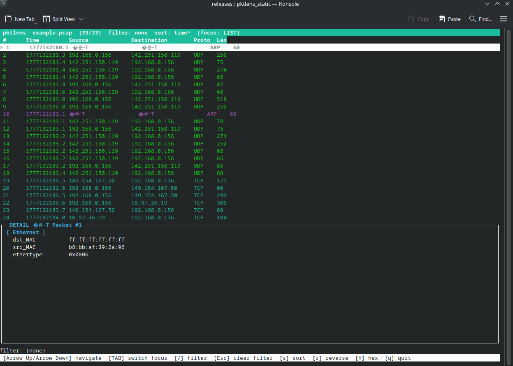

# PKTLENS

**pkglens** is a Unix-native, terminal-based packet capture viewer designed for developers, system administrators, and network engineers who need a fast, readable interface for inspecting .pcap and .pcapng files — without the installation overhead of Wireshark or the visual hostility of raw tcpdump output




## Features
 
- **Instant load** — opens multi-megabyte captures in under a second
- **Protocol-coloured packet list** — TCP, UDP, DNS, HTTP, ICMP, ARP each get a distinct colour
- **Filter language** — `tcp and dst 8.8.8.8`, `not udp`, `port 443`, `len > 512`, full boolean logic with parentheses
- **Sortable view** — by timestamp, packet size, or protocol; ascending or descending
- **Protocol tree** — decoded field-by-field view of the selected packet with scrolling
- **Hex dump** — raw bytes with ASCII sidebar, toggled with `h`
- **Terminal resize** — live SIGWINCH handling, layout reflows automatically
- **No runtime dependencies** — static binary available, drops onto any Linux system

**P.S: As for now - the only implemented protocols are Ethernet, IPv4, TCP/UDP!**

## Installation
 
### Pre-built binary (recommended)
 
Download the latest release for your platform from the [releases page](https://github.com/yourname/pktlens/releases):
 
| Platform         | Binary              |
|------------------|---------------------|
| Linux x86_64 static | `pktlens-static` |
 
```bash
chmod +x pktlens-static
./pktlens-static capture.pcap
```
 
The static binary has no dependencies and runs on any Linux kernel 3.x or later.
 
### Build from source
 
**Requirements:**
 
- GCC 4.8+ or Clang 3.5+ (C++14)
- CMake 3.10+
- libpcap + headers (`libpcap-devel` on Fedora, `libpcap-dev` on Debian/Ubuntu)
- ncurses + headers (`ncurses-devel` / `libncurses-dev`)
```bash
git clone https://github.com/yourname/pktlens.git
cd pktlens
mkdir build && cd build
cmake ..
make -j$(nproc)
sudo make install          # installs to /usr/local/bin
```
 
**Fedora / RHEL:**
```bash
sudo dnf install libpcap-devel ncurses-devel cmake gcc-c++
```
 
**Debian / Ubuntu:**
```bash
sudo apt install libpcap-dev libncurses-dev cmake g++
```
 
---
 
## Usage
 
```bash
pktlens <file.pcap>
```
 
pktlens takes a single pcap file as its argument. There are no flags — everything is done interactively inside the TUI.
 
### Keyboard reference
 
| Key | Action |
|-----|--------|
| `↑` / `↓` | Navigate packets (list focus) or scroll detail/hex (detail focus) |
| `PgUp` / `PgDn` | Page through packets or detail content |
| `g` / `G` | Jump to first / last packet |
| `Home` / `End` | Jump to top / bottom of detail or hex view |
| `Tab` | Switch keyboard focus between packet list and detail panel |
| `/` | Open filter input |
| `Esc` | Clear active filter |
| `s` | Cycle sort field: time → size → protocol → time |
| `r` | Reverse sort direction |
| `h` | Toggle hex dump mode in detail panel |
| `q` | Quit |
 
### Filter language
 
Filters are evaluated against every packet in the current view. The syntax is:
 
```
expr   :=  term  ( ('and' | 'or')  term )*
term   :=  'not' term  |  '(' expr ')'  |  atom
atom   :=  tcp | udp | dns | http | icmp | arp
        |  ip <addr>  |  src <addr>  |  dst <addr>
        |  port <n>
        |  len > <n>  |  len < <n>  |  len = <n>
```
 
**Examples:**
 
```
tcp
udp or dns
not icmp
tcp and dst 8.8.8.8
src 192.168.1.5 or dst 192.168.1.5
port 443
len > 1400
tcp and (src 10.0.0.1 or dst 10.0.0.1)
```
 
A failed filter expression leaves the previous filter active. The error message appears in the filter bar.
 
---
 
## Architecture
 
pktlens is built in strict layers. Each layer knows nothing about the layers above it:
 
```
PcapFileProvider  →  Dissectors  →  PacketStore  →  SessionModel  →  TUI
```
 
- **Capture** (`src/capture/`) — libpcap wrapper, pull-based iterator over raw packet bytes
- **Dissectors** (`src/dissectors/`) — Ethernet → IPv4 → TCP/UDP/ICMP/DNS chain, fills `ParsedPacket` and `ProtocolTree`
- **Model** (`src/model/`) — `PacketStore` with index-based sort and filter, never moves raw packet data
- **Filter** (`src/filter/`) — recursive-descent parser producing an AST evaluated against `ParsedPacket`
- **Session** (`src/session/`) — `SessionModel` owns everything, exposes a clean interface with no ncurses dependency
- **UI** (`src/ui/`) — ncurses panels, `App` event loop, `TerminalGuard` RAII

